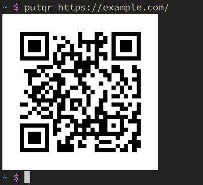

# putqr

[](https://rubygems.org/gems/putqr)

Display a QR code in your terminal.

If you're using [iTerm2](https://iterm2.com) on macOS,
the QR code will be displayed as an image.



## Install

Install `putqr` from [RubyGems](https://rubygems.org/):

```
gem install putqr
```

## Usage

Run the `putqr` command with the string you want to encode, like:

```
putqr https://example.com/
```

Run the command without arguments to read the data from standard input:

```
putqr < example.txt
```

## Development

To run the latest source code, check out the repository from GitHub:

```
git clone https://github.com/ljcooke/putqr.git
```

Install the dependencies using Bundler:

```
gem install bundler
bundle install
```

Run the tests and the `putqr` command using Bundler:

```
bundle exec rspec
bundle exec putqr
```
